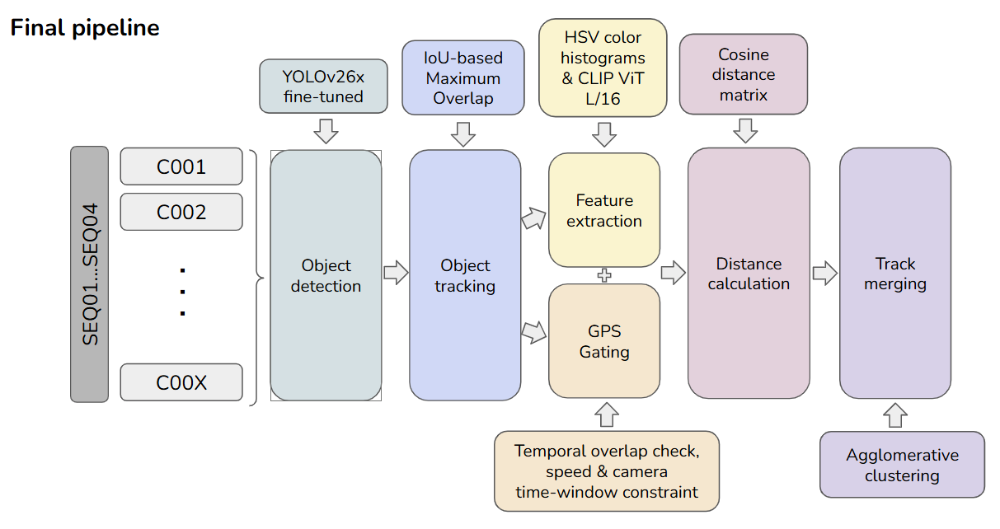

# 🚦 Video Surveillance for Road Traffic Monitoring

> **Module C6 — Video Analysis** · Team 7

**Team members:** Marc Aguilar · Oriol Marín · Pol Rosinés · Biel González · Alejandro Donaire

📊 [Final Presentation Link](https://docs.google.com/presentation/d/1-NpzQ1sC_2wRk7xEFmz8E-rZsN-2gXp9e9GX55mGjtw/edit?usp=sharing)

---

Welcome to Team 7's repository for the **Road Traffic Monitoring** project. Over four weeks, we progressively built a full multi-camera vehicle tracking system, tackling background subtraction, object detection, optical flow, and single-camera tracking — all leading to a complete **multi-camera tracking pipeline**.

This README focuses on **Week 4**. For earlier weeks, see the dedicated READMEs inside each `WeekX/` folder.

> **Dataset:** We work with the [CityFlowV2](https://www.aicitychallenge.org/) dataset (Naphade et al.), specifically sequences **S01**, **S03**, and **S04**.  
> *Tang et al., "CityFlow: A City-Scale Benchmark for Multi-Target Multi-Camera Vehicle Tracking and Re-Identification."*

---

## 📋 Table of Contents

- [Setup](#-setup)
- [Week 4 — Multi-Camera Tracking](#-week-4--multi-camera-tracking)
- [Week 3 — Optical Flow & Single-Camera Tracking](#-week-3--optical-flow--single-camera-tracking)
- [Week 2 — Object Detection & Tracking](#-week-2--object-detection--tracking)
- [Week 1 — Background Estimation](#-week-1--background-estimation)
- [Appendix](#-appendix)

---

## ⚙️ Setup

Before running any scripts, set up the environment as follows.

**1. Create and activate a virtual environment:**
```bash
python3 -m venv venv
source venv/bin/activate
```

**2. Install dependencies:**
```bash
pip install -r requirements.txt
```

**3. Expected directory structure:**
```
Root/
├── data/
│   └── AICity_data/
└── WeekN/
```

---

## 🎯 Week 4 — Multi-Camera Tracking

In Week 4 we combine all previous efforts into a final end-to-end pipeline for **multi-camera tracking (MTMC)**. The pipeline consists of three stages, incorporating temporal and spatial constraints to improve accuracy.



---

### Stage 1 · Object Detection

Detections are generated for all videos in a given sequence using models developed in Week 2.

| Script | Description |
|--------|-------------|
| `run_yolo.py` | Runs YOLO detection on all sequence videos and outputs detection files |

---

### Stage 2 · Single-Camera Tracking

Given the detections from Stage 1, per-camera tracking is performed.

| Script | Description |
|--------|-------------|
| `MTSC.py` | Takes detection files as input and runs a selected tracking method to produce per-camera tracking files |

---

### Stage 3 · Multi-Camera Tracking

Given the per-camera tracking files, this stage extracts appearance features, computes pairwise distances, and performs **agglomerative clustering** to assign global IDs across cameras.

**Main script:**
```bash
python MTMC.py S03 --n-hist-bins 8 --max-frames-sample 4 --dist-threshold 0.45
```

Results are automatically evaluated using the official `eval.py` script.

#### 🔧 Variant Scripts & Improvements

| Script | Description |
|--------|-------------|
| `MTMC_grid.py` | Hyperparameter grid search |
| `MTMC_gps.py` | Incorporates GPS information |
| `MTMC_gps_clip.py` | GPS integration combined with CLIP visual features |
| `MTMC_gps_run_all_tracking_vers.py` | GPS integration combined with the Time Windows and the `run_all_tracking.py` output format|
| `debug_clip.py` | Creates the distribution of positive and negative pairs per each feature  |


---

### 🖼️ Visualization

`viz_MTMC.py` — Visualizes ground truth vs. predictions for a given sequence, combining feeds from multiple cameras and displaying both detection boxes and global IDs across all selected cameras.

---

## 🌊 Week 3 — Optical Flow & Single-Camera Tracking

In Week 3 we focused on **motion estimation**, **optical flow**, and **object tracking**. We explored models including `pyflow`, `RAFT`, and `FlowFormer++`, and investigated how optical flow can enhance object detection.

**Main script:**
```bash
python run_all_tracking.py \
    --data-root <data_root> \
    --repo-root <repo_root> \
    --gt-xml <gt_xml>
```

> For full details, see [`Week3/README.md`](Week3/).

---

## 🔍 Week 2 — Object Detection & Tracking

In Week 2 we explored **off-the-shelf object detection** methods (YOLO variants), **fine-tuning strategies**, and **tracking algorithms** such as maximum overlap and Kalman filters — with custom improvements beyond vanilla implementations.

**Main script:**
```bash
python Week2/tracking/main.py \
    --method overlap \
    --detections Week2/detections/detections.txt
```

> For full details, see [`Week2/README.md`](Week2/).

---

## 🖼️ Week 1 — Background Estimation

In Week 1 we focused on **background estimation**, experimenting with Gaussian modelling, adaptive Gaussian modelling, and state-of-the-art models such as **LOBSTER** and **SubSENSE**.

**Main script:**
```bash
python3 main.py \
    --method mog2 \
    --mog2-history 300 \
    --mog2-var-threshold 25 \
    --mog2-detect-shadows false \
    --save-videos false \
    --save-mask-frames true \
    --scale 0.33
```

> For full details, see [`Week1/README.md`](Week1/).

---

## 📎 Appendix

Three scripts handle the Week 4 YOLO fine-tuning workflow:

| Script | Description |
|--------|-------------|
| `Week4/finetuning/convert_mot_to_yolo.py` | Converts AI City MOT annotations to YOLO format (`S01+S04 → train/val`, `S03 → test`) |
| `Week4/finetuning/fine_tune_yolo.py` | Trains / fine-tunes a YOLO model using a dataset YAML |
| `Week4/finetuning/eval_s03_models.py` | Evaluates off-the-shelf and/or fine-tuned models on the S03 test set |

---

### Step 1 · Convert Dataset

```bash
source ~/C6/venv/bin/activate
cd /home/pol/C6/mcv-c6-2026-team7

python Week2/finetuning/convert_mot_to_yolo.py \
  --data-root data/AI_CITY_CHALLENGE_2022_TRAIN/train \
  --output data/yolo_s01s04_trainval_s03_test \
  --train-seqs S01 S04 \
  --test-seqs S03 \
  --val-ratio 0.2 \
  --class-name vehicle
```

### Step 2 · Fine-Tune Model

```bash
source ~/C6/venv/bin/activate
cd /home/pol/C6/mcv-c6-2026-team7

python Week2/finetuning/fine_tune_yolo.py \
  --data data/yolo_s01s04_trainval_s03_test/dataset.yaml \
  --model /home/pol/C6/mcv-c6-2026-team7/yolo26x.pt \
  --epochs 20 \
  --batch 4 \
  --imgsz 640 \
  --name s01s04_to_s03_yolo26x
```

### Step 3 · Evaluate on S03 Test Set

```bash
source ~/C6/venv/bin/activate
cd /home/pol/C6/mcv-c6-2026-team7

python Week2/finetuning/eval_s03_models.py \
  --data data/yolo_s01s04_trainval_s03_test/dataset.yaml \
  --split test \
  --save-json
```

---

*Module C6 · Master in Computer Vision, UAB · 2026*
